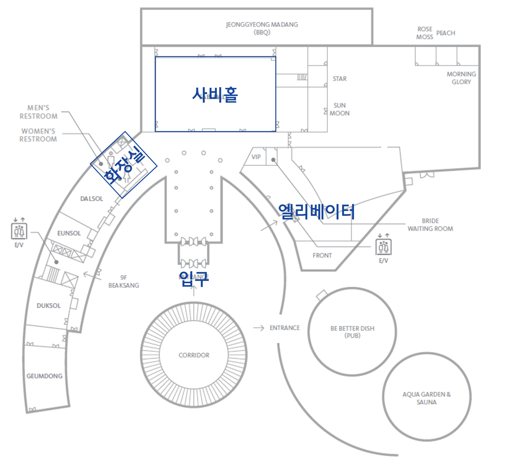

# 2026년도 CL 워크숍 안내

## 워크숍 개요

- 목적 : 조직문화 변화 주도자로서의 CL 역할이해, CL 간의 유대감 강화 및 네트워킹, 조직별 업무효율화 아이디어 구체화
- 대상 : 전사 CL 87명
- 일정 : 2026. 3. 19(목) ~ 3. 20(금) / 1박 2일

#### 1일차 주요 일정

    10:00 ~ 10:30 : Orientation (컬처디자인팀)
    10:30 ~ 11:20 : 조직문화이야기 (컬처디자인팀장)
    11:20 ~ 12:00 : CL연관 조직문화 활동소개 (컬처디자인팀)
    12:00 ~ 13:00 : 중식 (@1F, 본디마슬)
    13:00 ~ 14:30 : 조직문화활동 업무 및 시스템 소개 (컬처디자인팀)
    14:30 ~ 16:00 : 외부 전문가 특강; 조직문화와 성과 (동국대학교 이중학 교수)
    16:00 ~ 16:30 : 숙소체크인 및 사비홀 복귀
    16:30 ~ : 사장님 말씀 및 석식 간담회

#### 2일차 주요 일정

    08:00 ~ 09:30 : 제철레시피북 Review
    09:30 ~ 12:00 : 업무효율화과제 구체화 Workshop
    12:00 ~ 13:00 : 중식

#### 시설안내

- **다이닝** : [바로가기](https://www.lotteresort.com/buyeo/ko/dining)
- **편의시설** : [바로가기](https://www.lotteresort.com/buyeo/ko/facility)

## 개인별 안내사항

### 조편성

### 숙소편성

### 복귀 단체버스 탑승

## 비상연락망

###
